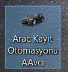

# Customer-Registration-Project
# Araç Kayıt Otomasyonu

## Proje Açıklaması

Bu proje, araç kayıt işlemlerini kolaylaştırmak ve yönetmek için geliştirilmiş bir otomasyon sistemidir. Kullanıcılar, araç bilgilerini kaydedebilir, güncelleyebilir, silebilir ve listeleyebilir. Ayrıca, araç kayıtlarına ait raporlar oluşturulabilir.

## Özellikler

* **Araç Kaydı:** Araç marka, model gibi bilgilerin kaydedilmesi.
* **Araç Güncelleme:** Kaydedilen araç bilgilerinin güncellenmesi.
* **Araç Silme:** Kaydedilen araç bilgilerinin silinmesi.
* **Araç Listeleme:** Kaydedilen araçların listelenmesi.
* **Raporlama:** Araç kayıtlarına ait raporların oluşturulması (örneğin, numaraya, isme göre).
* **Kullanıcı Yönetimi:** Kullanıcıların sisteme erişim yetkilerinin yönetimi (isteğe bağlı).
* **Veritabanı Entegrasyonu:** Verilerin güvenli bir şekilde saklanması için MySQL veritabanı entegrasyonu.
* **Kullanıcı Dostu Arayüz:** Kolay ve anlaşılır bir kullanıcı arayüzü.

## Teknolojiler

* Java (Swing)
* MySQL
* JDBC (Java Database Connectivity)

## Kurulum

1.  **Gereksinimler:**
    * Java Development Kit (JDK) 8 veya üzeri
    * MySQL Server
    * MySQL JDBC sürücüsü
2.  **Veritabanı Kurulumu:**
    * MySQL Server'ı kurun ve çalıştırın.
    * Projede kullanılan veritabanı şemasını (SQL dosyası) MySQL'e aktarın.
    * Veritabanı bilgilerini projede bulunan bağlantı dosyasına girin.
3.  **Proje Kurulumu:**
    * Projeyi bir Java IDE'si (örneğin, IntelliJ IDEA, Eclipse) ile açın.
    * MySQL JDBC sürücüsünü projeye ekleyin.
    * Projeyi derleyin ve çalıştırın.

## Kullanım

1.  Uygulamayı çalıştırın.
2.  Gerekli bilgileri girin ve işlemi tamamlayın.

## Ekran Görüntüleri

* 
* 

## Katkıda Bulunma

Katkılarınızı bekliyoruz! Projeye katkıda bulunmak için lütfen GitHub üzerinden "pull request" gönderin.

## İletişim

Sorularınız veya geri bildirimleriniz için lütfen \[azizkaragulmez07@gmail.com] ile iletişime geçin.

